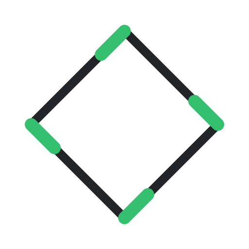
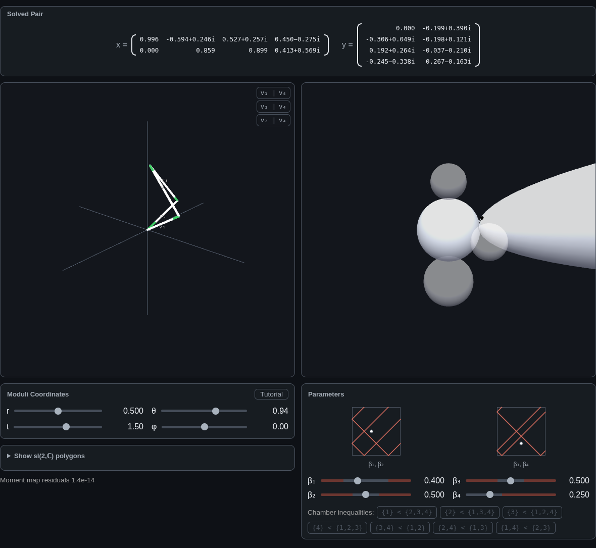
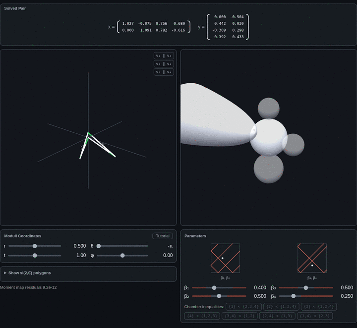
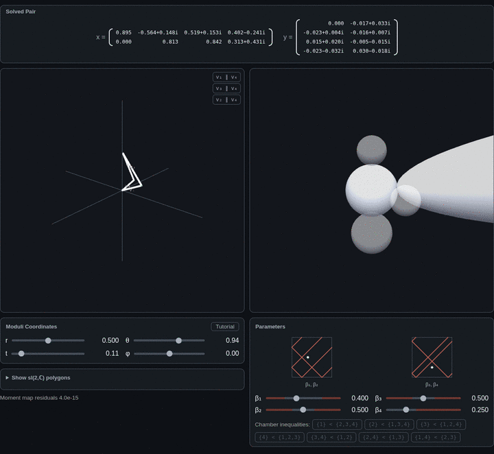

<div align="center">



# Hyperpolygon Moduli Spaces

**An interactive, browser-native solver for the moduli space of four-sided star-quiver hyperpolygons.**

[](LICENSE)
[](https://arya-yae.github.io/hyperpolygon-moduli-spaces/)
[](#tests)



</div>

This is a self-contained numerical laboratory for **hyperpolygon spaces** — the
four-dimensional hyperkähler moduli spaces attached to the four-sided star
quiver with dimension vector $(2,1,1,1,1)$. Drag the sliders and the widget
solves the moment-map equations live in the browser (typically sub-millisecond),
then draws both the resulting polygon and your current position in the moduli
space. There is a built-in tutorial; no build step, no server, no dependencies
beyond a vendored copy of three.js.

## Try it

| | |
|---|---|
| **Live** | **<https://arya-yae.github.io/hyperpolygon-moduli-spaces/>** (GitHub Pages) |
| **Single file** | Download [`hyperpolygon.html`](hyperpolygon.html) — everything inlined, works offline when opened over HTTP |
| **Local** | `python3 -m http.server 8000` in this folder, then open <http://localhost:8000/> |

> The widget is an ES-module app, so it must be served over **HTTP**, not opened
> directly as a `file://` path. The single-file build inlines all modules, but
> browsers still restrict module scripts on `file://` — use one of the options
> above.

## What you are looking at

The widget has two linked views.

**Left — the hyperpolygon.** The hyperpolygon space $\mathcal X(\vec\beta)$ is a
moduli space of representations of the four-sided **star quiver** — one central
node of dimension $2$ with a leg of dimension $1$ attached on each side:

```text
       1         1
        \       /
         \     /
  1 ----- (2) ----- 1
```

A stable representation is a pair of
matrices $(x,y)$ — a $2\times 4$ matrix of column vectors $x_i$ and a $4\times2$
matrix of row vectors $y_i$ — satisfying the moment-map equations below. The
left view draws the associated **telescoping polygon** in
$\mathfrak{su}(2)\cong\mathbb R^3$: the $v_i=(x_ix_i^\dagger)_0$ and
$w_i=(y_i^\dagger y_i)_0$ assemble head-to-tail and close up. The green/white
edges are legs whose $v$- and $w$-directions become parallel at special points;
the yellow highlight fires exactly when a leg pair is parallel.

**Right — the moduli space.** The right view tracks your current point in
$\mathcal X(\vec\beta)$. The central sphere is the locus where the quiver lives
on a single central node; the three exterior spheres are the wall-crossing
partners where a pair of legs goes straight. The dot climbs a paraboloid in the
$t$ direction and rides the spheres at the endpoint snaps. The two small plots
show the **stability chamber** — the seven wall inequalities
$(\text{subset}) < (\text{complement})$ — as red lines, with your current
$\vec\beta$ as a black dot.



**Wall-crossing.** Stability data $\vec\beta$ is chambered by the seven
partitions of the four legs into equal-sum halves. Drag a $\beta_i$ slider and
it clamps exactly against a chamber wall; an inequality box turns amber and a
**Cross Wall** button appears. Crossing flops to the adjacent chamber *at fixed
$\vec\beta$*, relabeling which pairs are short — the moduli space is glued from
these chambers along shared **strata**. The **lim t→∞** button enters the
$I$-stratum of a wall directly: the doubly-straight stick that the flow
approaches as $t\to\infty$.



## The mathematics

Let $Q$ be the four-sided star quiver with dimension vector $(2,1,1,1,1)$. A
representation consists of $x\in\mathbb C^{2\times4}$ (columns $x_1,\dots,x_4$)
and $y\in\mathbb C^{4\times2}$ (rows $y_1,\dots,y_4$). The hyperpolygon space
$\mathcal X(\vec\beta)$ is the hyperkähler quotient of the solutions to

$$
\mu_{\mathrm{SL}(2,\mathbb C)}(x,y)=\sum_{i=1}^{4}x_iy_i=0,
\qquad
\mu_{\mathrm{GL}(1,\mathbb C),i}(x,y)=y_ix_i=0,
$$

$$
\mu_{\mathrm{SU}(2)}(x,y)=\sum_{i=1}^{4}\bigl(x_ix_i^\dagger\bigr)_0-\bigl(y_i^\dagger y_i\bigr)_0=0,
\qquad
\mu_{\mathrm{U}(1),i}(x,y)=\tfrac12\bigl(|x_i|^2-|y_i|^2\bigr)=\beta_i,
$$

by $G=\mathrm{SU}(2)\times\mathrm{U}(1)^4$. Writing
$v_i=(x_ix_i^\dagger)_0$ and $w_i=(y_i^\dagger y_i)_0$:

- $y_ix_i=0$ forces $v_i$ and $w_i$ to be antiparallel;
- $\mu_{\mathrm{U}(1),i}=\beta_i$ fixes the side-length difference
  $|v_i|-|w_i|=\sqrt2\,\beta_i$;
- $\mu_{\mathfrak{su}(2)}=0$ is the closure condition $\sum_i(v_i-w_i)=0$.

So solutions are exactly telescoping polygons in $\mathfrak{su}(2)\cong\mathbb R^3$,
up to $\mathrm{SO}(3)$ rotation: **the moduli space is a space of polygons**. By
the Kempf–Ness theorem, every stable representation is $G$-equivalent to a unique
moment-map-balanced representative, which is the one the widget displays.

## Architecture

The solver is dependency-free ES-module JavaScript. The display layer uses a
vendored three.js only.

| Module | Role |
|---|---|
| `assets/js/hyperpolygon/solver.js` | The moment-map pipeline: builds the star/cycle/exterior/stratum ansatz, solves the complex linear $y$-system, balances $(\mathbb C^*)^4$ in closed form and runs the SL(2,$\mathbb C$) Newton step (with fallbacks and rescues). Returns the balanced pair plus gauge-invariant polygon data and residuals. |
| `assets/js/hyperpolygon/chambers.js` | Stability-chamber geometry: `shortSubsets`, closed per-leg allowed intervals, wall detection, and the chamber-locked drag. |
| `assets/js/hyperpolygon/orientation.js` | Display-orientation servo: pins the polygon chord, parks the twist, and absorbs residual gauge jumps. |
| `assets/js/hyperpolygon/sideview.js` | The moduli-space side view (pure geometry/probe layer + a three.js factory). |
| `assets/js/hyperpolygon/sideview-shared.js` | Shared flow constants and vector helpers for the side view. |
| `assets/js/hyperpolygon/tutorial.js` | The guided-tour state machine (no solver coupling). |
| `assets/js/hyperpolygon/widget.js` | DOM, sliders, matrix readout, polygon/SL(2,$\mathbb C$) views, chamber plots, strata and palette handling. |
| `assets/js/hyperpolygon/lib/` | Vendored `three.min.js` and `OrbitControls.js`. |

### Solver in one paragraph

For a given $(\vec\beta,r,\theta,t)$ the solver writes down a **star ansatz**
for $x$, solves the seven complex linear equations
$\mu_{\mathrm{SL}(2,\mathbb C)}=\mu_{\mathrm{GL}(1,\mathbb C),i}=0$ for the free
entries of $y$ (with $y_{42}=t/(1-t)$ prescribed), balances the
$(\mathbb C^*)^4$ action in closed form, then runs a Newton iteration on the
remaining $\mathrm{SL}(2,\mathbb C)$ gauge to make the $\mathfrak{su}(2)$ moment
map vanish. Degenerate loci (the endpoint snaps $r=0,1$, the interior locus
$r e^{i\theta}=1-r$, and chamber walls) are handled by dedicated closed-form
branches, gated retries and "display at the limit" offsets. Because the output
is only defined up to residual $U(2)\times U(1)^4$ gauge, all validation compares
**gauge-invariant** quantities (per-leg $|y_i|^2$, polygon edge lengths and
moment-map residuals), never raw matrices.

## Tests

The repository ships the full Node validation harness used during development.
It has no dependencies and runs on plain Node.

```bash
bash tests/run.sh          # the gate: sweep, edge, walls, locus, star, cycle,
                           # stratum, sideview, exterior, orient, validate
node tests/bench.mjs       # hot-path micro-benchmarks (manual)
node tests/fingerprint.mjs check   # bit-exact behavioral fingerprint (manual)
```

The batteries assert the numerics that make the widget trustworthy:

- **Robustness** — random $\vec\beta$ and $(r,\theta,t)$ grids solve to
  $\mathfrak{su}(2)$ residual $\sim10^{-11}$ and $\mathrm{U}(1)$ residual
  $\le10^{-9}$.
- **Endpoints and lenses** — the formerly broken bands near $r=0,1$ and the
  degenerate interior locus are exercised explicitly.
- **Chambers** — wall conditioning, clamp idempotency, drag semantics,
  cross-wall flops, and the coherent attachment map.
- **Bit-exactness** — historical ansatz paths must remain bit-identical across
  refactors; `fingerprint.mjs check` enforces this.

See [`tests/README.md`](tests/README.md) for the full description.

## Updates

While this widget also lives on its author's personal website, this repository
is the standalone packaging. The `assets/js/hyperpolygon/` modules are the
source of truth; `hyperpolygon.html` and the README media are generated. A sync
script in the parent project copies updated modules in and regenerates the
single-file build and media, so the two stay in lock-step.

## Author

**Arya Yae** — questions, corrections and pull requests welcome.

## License

Released under the [MIT License](LICENSE). The bundled `three.js` is under its
own MIT license (see `assets/js/hyperpolygon/lib/`).